# 🚀 AWS Project 4 — Load Balancer + Auto Scaling

---

## 📌 Project Overview

In this project, I built a scalable and highly available infrastructure using AWS.

The goal was to understand how real cloud systems handle traffic, scale automatically, and recover from failures.

Instead of using a single EC2 instance, I created a system with:

* Application Load Balancer
* Auto Scaling Group
* Multiple EC2 instances
* Health checks

---

## ⚙️ Step 1: Creating Launch Template

First, I created a Launch Template, which is required for Auto Scaling.

It defines how EC2 instances should be created:

* OS: Amazon Linux 2023
* Instance type: t3.micro
* Security Group:

  * HTTP (80) → 0.0.0.0/0
  * SSH (22) → My IP

I also added a **User Data script** to automatically install Apache:

```
#!/bin/bash
dnf update -y
dnf install -y httpd
systemctl start httpd
systemctl enable httpd
echo "<h1>Instance $(hostname)</h1>" > /var/www/html/index.html
```

This ensures that every EC2 instance is ready and identical.

---

## 🎯 Step 2: Creating Target Group

Then I created a Target Group to manage EC2 instances.

* Protocol: HTTP
* Port: 80
* VPC: same as Project 3

Health checks:

* Protocol: HTTP
* Path: `/`

This allows AWS to verify that the web server is actually working.

---

## 🌐 Step 3: Creating Application Load Balancer

Then I created an Application Load Balancer (ALB).

Configuration:

* Internet-facing
* Connected to VPC
* Two public subnets (different AZs for high availability)

Security Group:

* HTTP (80) → 0.0.0.0/0

Listener:

* HTTP:80
* Forward to Target Group

---

## ⚙️ Step 4: Creating Auto Scaling Group

After that, I created the Auto Scaling Group.

Connected components:

* Launch Template
* Target Group
* Load Balancer
* VPC + 2 public subnets

Configuration:

* Desired capacity: 2
* Min: 1
* Max: 3

Scaling Policy:

* Target tracking
* Metric: CPU utilization
* Target: 50%

This means:

* If CPU > 50% → new EC2 is created
* If CPU goes down → instances can be removed

---

## 🔧 Step 5: Troubleshooting & Fix

At first, instances were showing **unhealthy**.

The issue:

* Public IP auto-assign was disabled in public subnets

Because of that:

* EC2 couldn't access internet
* Apache was not installed
* Health checks failed

Fix:

* Enabled auto-assign public IPv4
* Recreated instances

Result:

* 2 instances
* Both healthy

---

## 🧠 What I Learned

* How to design a scalable architecture
* Difference between Load Balancer and Target Group
* How Auto Scaling works with CPU metrics
* Importance of health checks
* Real-world troubleshooting

---

## 🔧 Problems Solved

* Fixed unhealthy instances caused by no internet access
* Understood how public IP affects EC2 behavior
* Fixed Auto Scaling desired capacity configuration

---

## 🏗️ Architecture Summary

* Load Balancer → distributes traffic
* Target Group → checks instance health
* Auto Scaling → creates and replaces EC2
* EC2 → runs Apache web server

---

## 📸 Screenshots

### Launch Template

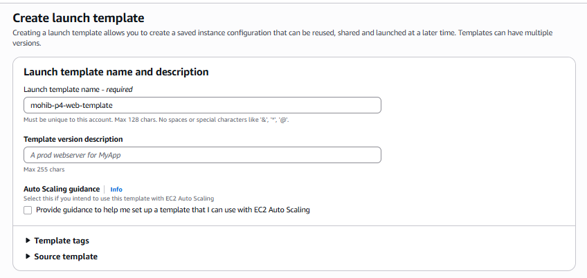
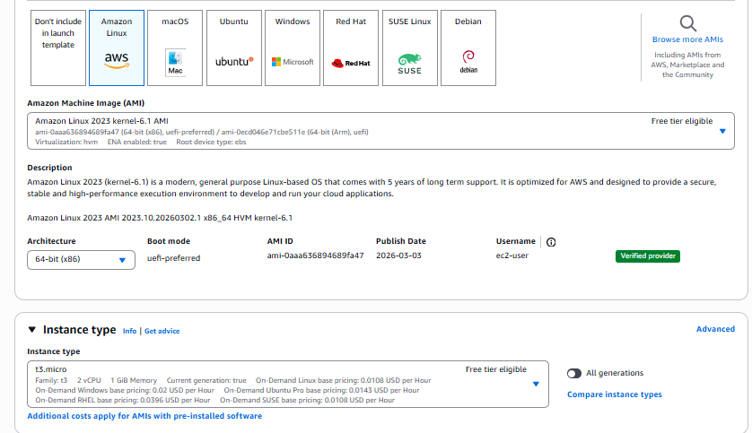
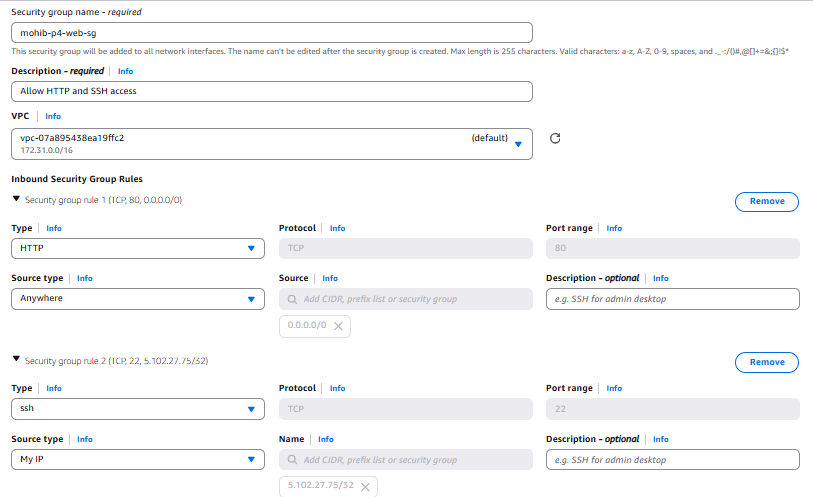
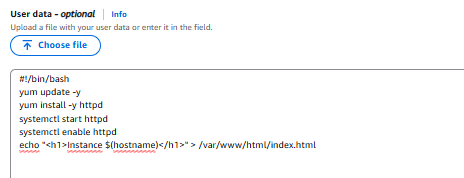


### Target Group

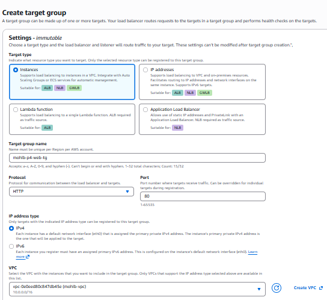
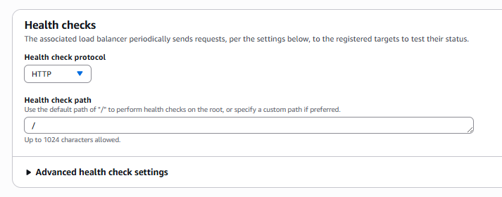
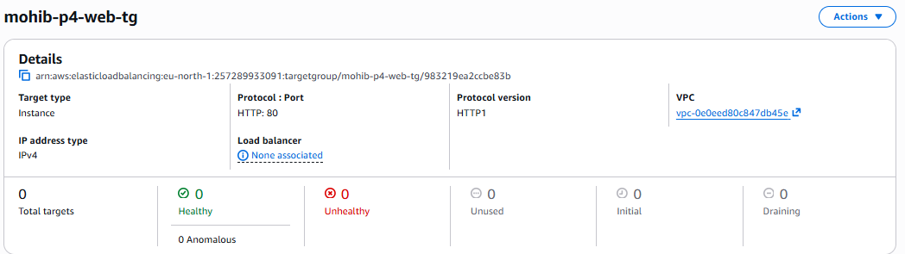

### Load Balancer

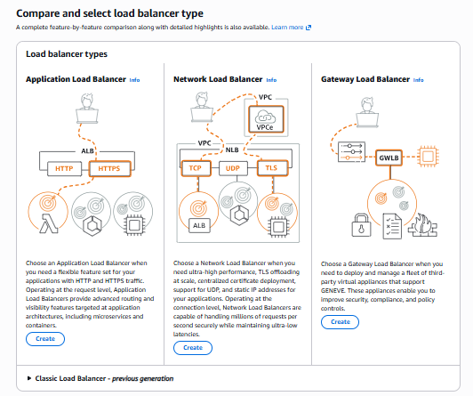
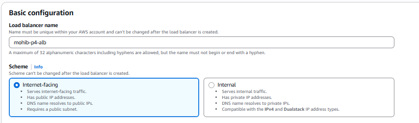
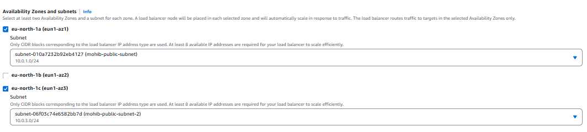

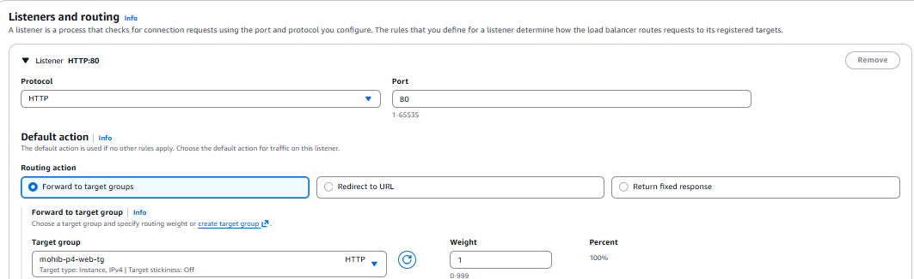
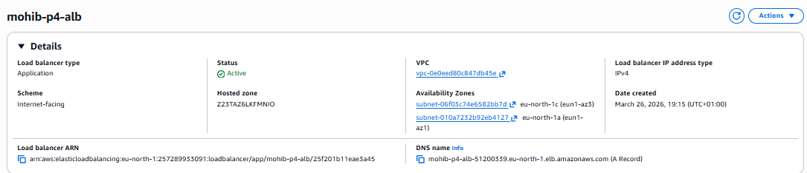

### Auto Scaling

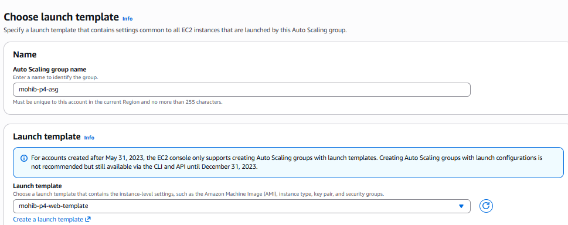
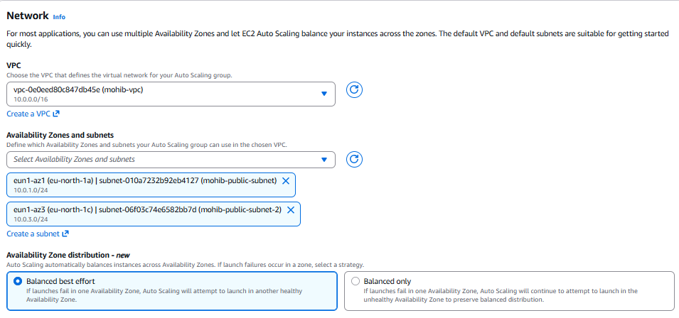
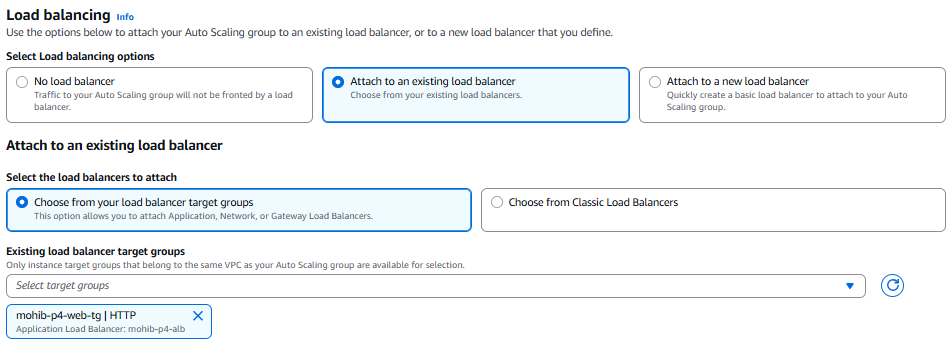
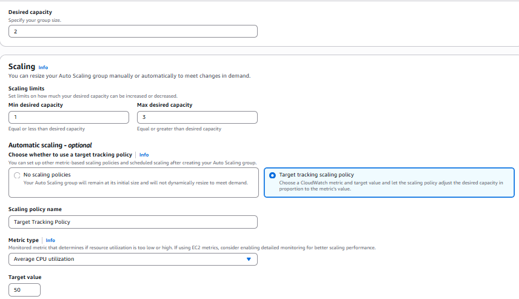
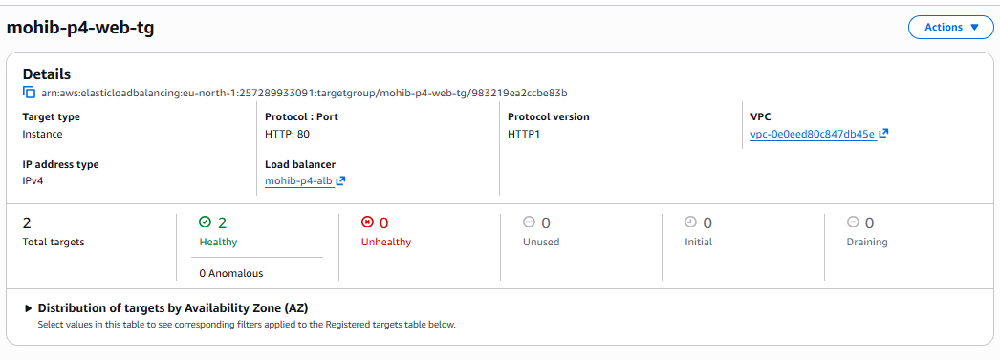

---

## 👨‍💻 Author

Mohib Rizwan
